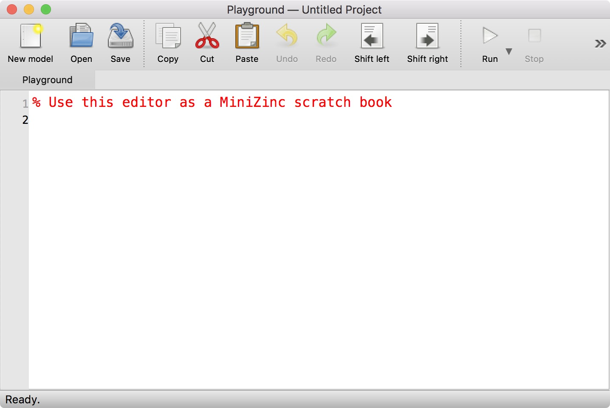
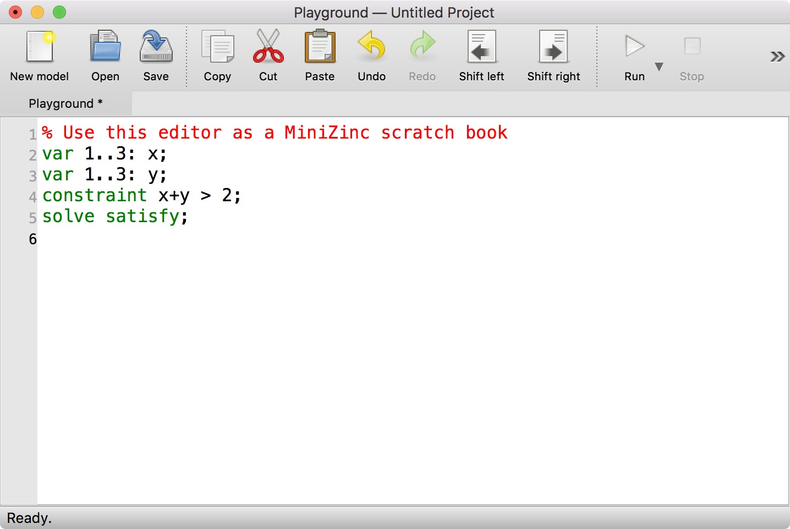
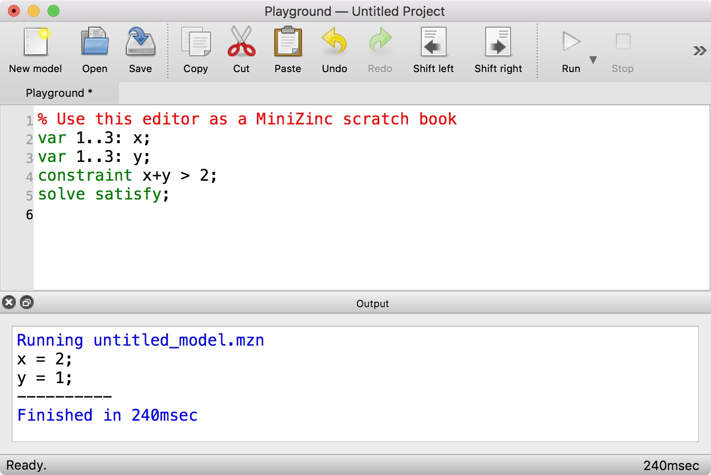
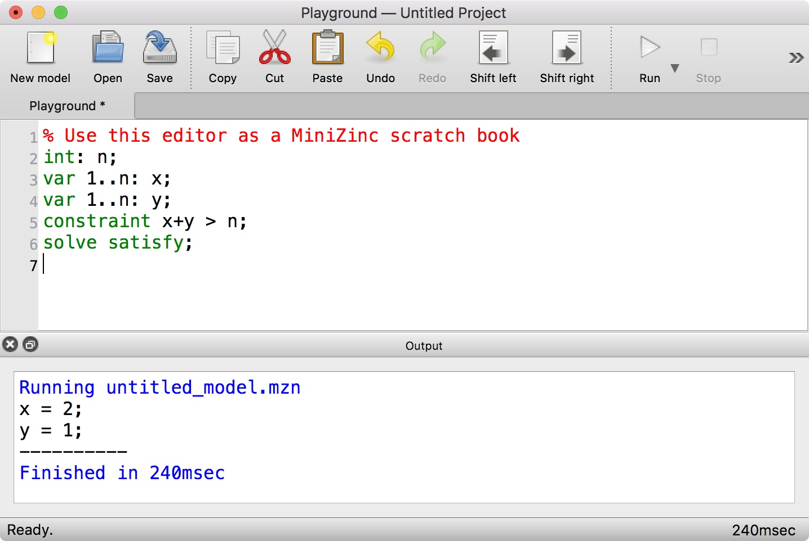
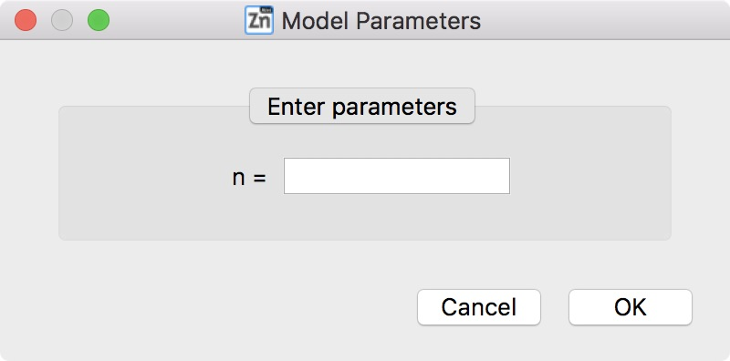
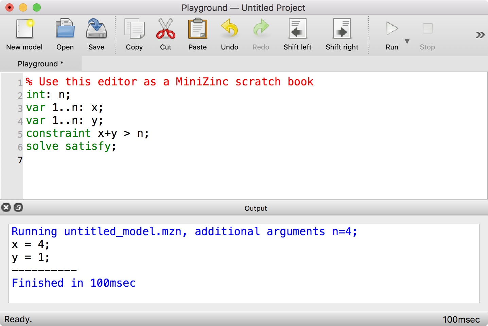
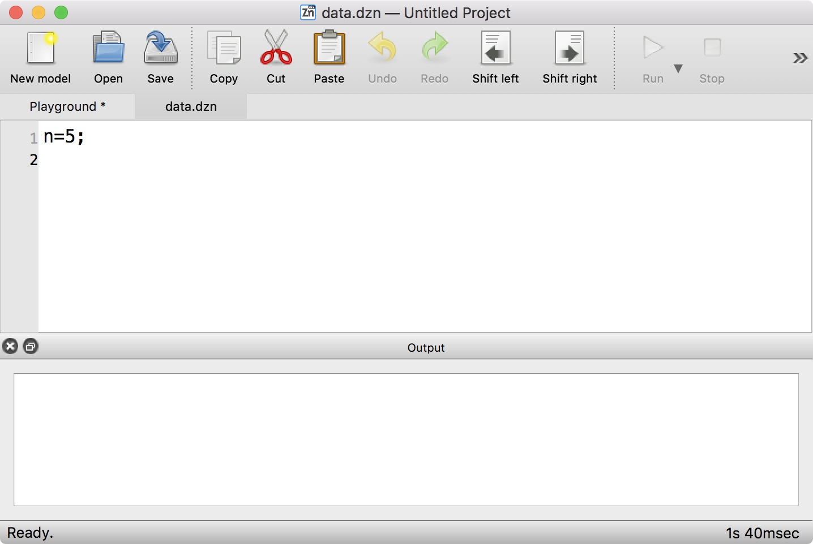
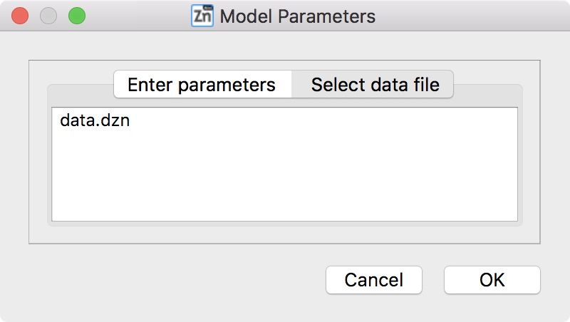
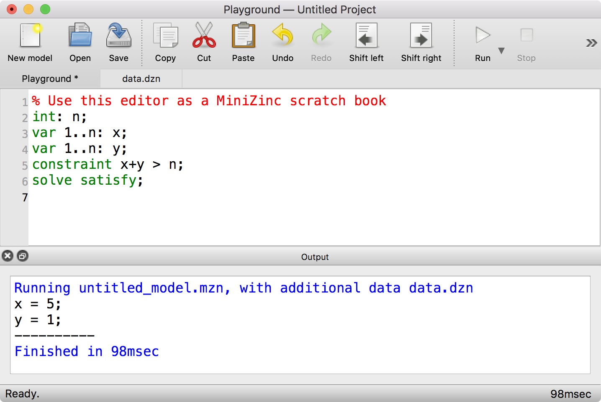

.. _ch-first-steps:

First steps with MiniZinc
=========================

We recommend using the bundled binary distribution of MiniZinc introduced in :numref:`ch-installation`. It contains the MiniZinc IDE, the MiniZinc compiler, and several pre-configured solvers so you can get started straight away.

This section introduces the MiniZinc IDE and the command line tool ``minizinc`` using some very basic examples. This should be enough to get you started with the MiniZinc tutorial in :numref:`part-tutorial` (in fact, you only need to be able to use one of the two, for instance just stick to the IDE if you are not comfortable with command line tools, or just use the ``minizinc`` command if you suffer from fear of mice).

The MiniZinc IDE
----------------

The MiniZinc IDE provides a simple interface to most of MiniZinc's functionality. It lets you edit model and data files, solve them with any of the solvers supported by MiniZinc, run debugging and profiling tools, and submit solutions to online courses (such as the MiniZinc Coursera courses).

When you open the MiniZinc IDE for the first time, it will ask you whether you want to be notified when an update is available. If you installed the IDE from sources, it may next ask you to locate your installation of the MiniZinc compiler. Please refer to :numref:`sec-ide-config` for more details on this.

The IDE will then greet you with the *MiniZinc Playground*, a window that will look like this:

You can start writing your first MiniZinc model! Let's try something very simple:

In order to solve the model, you click on the *Run* button in the toolbar, or use the keyboard shortcut *Ctrl+R* (or *command+R* on macOS):

As you can see, an output window pops up that displays a solution to the problem you entered.
Let us now try a model that requires some additional data.

When you run this model, the IDE will ask you to enter a value for the parameter *n*:

After entering, for example, the value 4 and clicking *Ok*, the solver will execute the model for *n=4*:

Alternatively, data can also come from a file. Let's create a new file with the data and save it as ``data.dzn``:

When you now go back to the *Playground* tab and click *Run*, the IDE will give you the option to select a data file:

Click on the ``data.dzn`` entry, then on *Ok*, and the model will be run with the given data file:

Of course you can save your model to a file, and load it from a file, and the editor supports the usual functionality.

If you want to know more about the MiniZinc IDE, continue reading from :numref:`ch-ide`.

The MiniZinc command line tool
------------------------------

The MiniZinc command line tool, ``minizinc``, combines the functionality of the MiniZinc compiler, different solver interfaces, and the MiniZinc output processor. After installing MiniZinc from the bundled binary distribution, you may have to set up your ``PATH`` in order to use the command line tool (see :numref:`ch-installation`).

Let's assume we have a file ``model.mzn`` with the following contents:

::

  var 1..3: x;
  var 1..3: y;
  constraint x+y > 3;
  solve satisfy;
  
You can simply invoke ``minizinc`` on that file to solve the model and produce some output:

.. code-block:: none
  
  $ minizinc model.mzn
  x = 3;
  y = 1;
  ----------
  $

If you have a model that requires a data file (like the one we used in the IDE example above), you pass both files to ``minizinc``:

.. code-block:: none

  $ minizinc model.mzn data.dzn
  x = 5;
  y = 1;
  ----------
  $

The ``minizinc`` tool supports numerous command line options. One of the most useful options is ``-a``, which switches between *one solution* mode and *all solutions* mode. For example, for the first model above, it would result in the following output:

.. code-block:: none
  
  $ minizinc -a model.mzn
  x = 3;
  y = 1;
  ----------
  x = 2;
  y = 2;
  ----------
  x = 3;
  y = 2;
  ----------
  x = 1;
  y = 3;
  ----------
  x = 2;
  y = 3;
  ----------
  x = 3;
  y = 3;
  ----------
  ==========
  $

To learn more about the ``minizinc`` command, explore the output of ``minizinc --help`` or continue reading in :numref:`ch-cmdline`.
