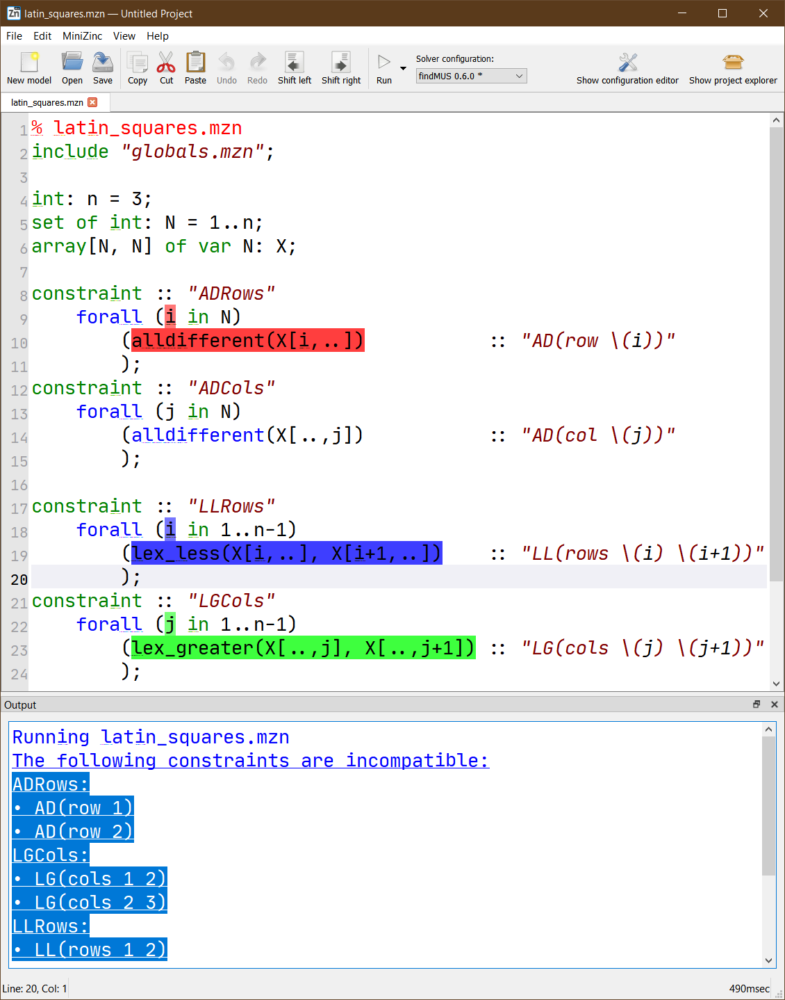
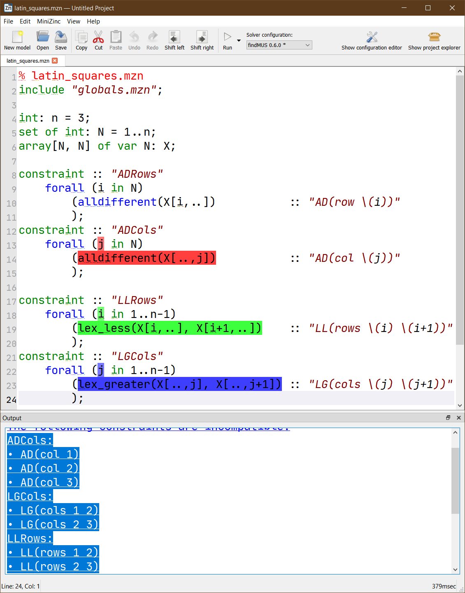
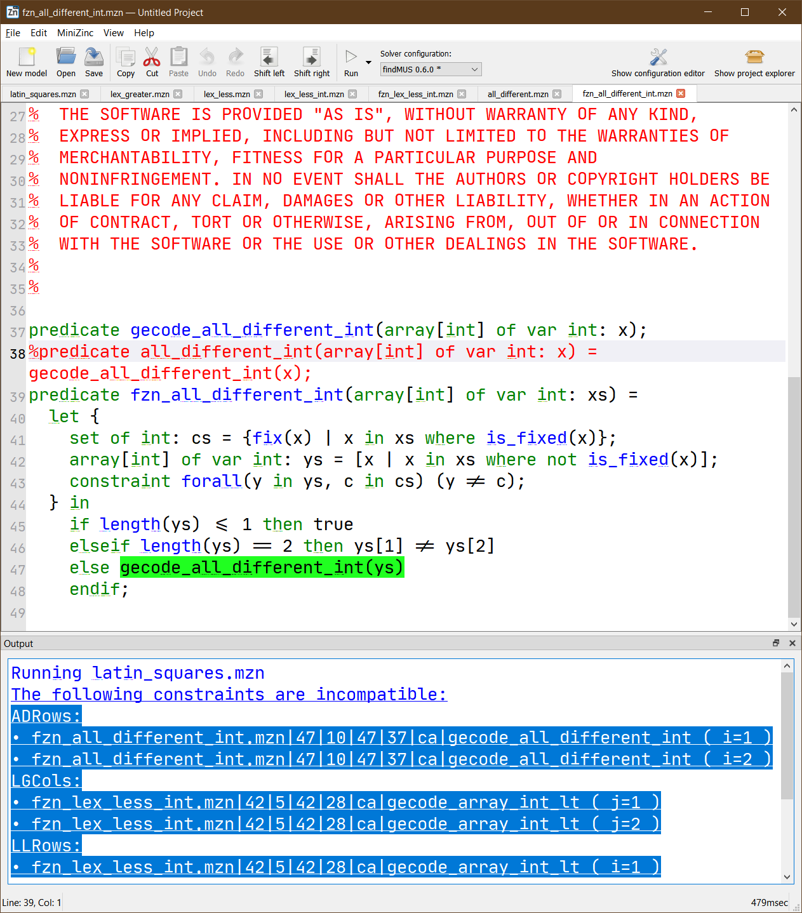

FindMUS 
=======

Version: 0.6.0

FindMUS [1]_ lists unsatisfiable subsets of constraints in your MiniZinc
model.  These subsets, called Minimal Unsatisfiable Subsets can help
you to find faults in your unsatisfiable constraint model.  FindMUS uses
the hierarchical structure provided by the model to guide its search.

Basic Usage
-----------

To use FindMUS on the command line simply execute it on a model and set
of data files by typing:

``findMUS model.mzn data-1.dzn``

This will perform a search for a single instance level MUS.
To acquire a low level MUS the ``--paramset fzn`` argument can be used.
To search for more than one MUS use the ``-a`` or ``-n <count>`` arguments.
By default FindMUS will use ``gecode_presolver`` for checking the
satisfiability of a subset of constraints. This can be changed using the
``--subsolver`` argument.  For example, given a model that is better
suited to a Mixed Integer Programming solver, the argument
``--solver cbc`` could be used to instruct FindMUS to flatten the model
with the linear library and use the CBC solver for satisfiability checking.

Note: FindMUS requires a fully instantiated constraint model.

Commandline arguments
^^^^^^^^^^^^^^^^^^^^^

The FindMUS tool supports the following arguments:

**Driver options**

The driver creates the map solver and sub-solver and requests MUSes from
FindMUS's enumeration algorithm HierMUS.

``-n &lt;count&gt;``   Stop after the *n* th MUS is found (Default: 1)

``-a``   Find all MUSes (equivalent to ``-n 0``)

``-t`` or ``--timeout &lt;s&gt``   Stop search after *s* seconds (Default: 1800)

``--paramset hint,mzn,fzn``
  Use a preset collection of parameters. (Default: mzn)
  The ``mzn`` and ``fzn`` options can acquire MUSes in more detail.
  
  ``hint`` --structure gen --depth mzn --shrink-alg map_lin

  ``mzn`` --structure normal --depth mzn --shrink-alg map_qx

  ``fzn`` --structure normal --depth fzn --shrink-alg map_qx

``--no-leftover``
  Do not print leftover candidate on timeout
  If FindMUS is exploring an unsatisfiable subset when it runs out of time,
  it behaves as if the set could not be reduced to a smaller set and prints
  it as an MUS. The ``--no-leftover`` setting disables this behaviour as
  these sets can sometimes be quite large.

``--frequent-stats`` Print statistics after every MUS discovered.

``--no-progress`` Disable ``%%%mzn-progress`` output

``--no-stats`` Disable output of initial parsing stats and summary stats

``--output-{html, json, brief, human}`` Changes output mode

  ``html`` HTML output mode for use with the MiniZinc IDE

  ``json`` Simple json output (each MUS should be parsed separately)

  ``brief`` Same as the default output mode but without outputting the traces (paths)

  ``human``
  Tries to format the MUS in a more readable form grouping constraints by their constraint names

**Compiler Options**

``-g`` or ``--domains`` Record domain changes during compilation (same as ``minizinc -c -g``)

``--verbose-compile`` Pass ``--verbose`` to MiniZinc compiler

**Enumeration options**

The enumeration algorithm (HierMUS) explores the constraint hierarchy
provided in the user's model and proposes potential MUSes to the
sub-solver.  A ``shrink`` algorithm is used to reduce found UNSAT subsets
to MUSes. There are currently four available shrink algorithms available
with FindMUS.

``--shrink-alg lin,map_lin,qx,map_qx,qx2``
  Select shrink algorithm (Default: map_lin)

    ``lin`` simple linear shrink algorithm.

    ``map_lin`` alternative implementation of the linear algorithm that
    updates a global map of explored subsets while shrinking the subset.

    ``qx`` uses the ``QuickXplain`` [4]_ algorithm to shrink the subset
    to a MUS.

    ``map_qx`` is an alternative implementation of ``QuickXplain`` that
    uses the global map to split subsets, and to avoid repeating any SAT
    checks while shrinking

    ``qx2`` a lightweight alternative to ``map_qx`` that only uses the
    map to avoid repeating SAT checks.

``--depth mzn,fzn,&lt;n&gt``
  How deep in the tree should search explore. (Default: mzn)

    ``mzn`` expands the search as far as the point when the compiler
    leaves the MiniZinc model.

    ``fzn`` expands search as far as the FlatZinc constraints.

    ``&lt;n&gt`` expand search to the *n* level of the hierarchy.

``--restarts`` Enable restart to flat mode (plain Marco) if large run of SAT sets encountered

``--seed <n>`` Set the random seed used for splitting with ``map_qx``

**Subsolver options**

FindMUS can be used in conjunction with any FlatZinc solver. These
options mimic the ``minizinc`` arguments ``--solver`` and
``--fzn-flags``. The behavior of these arguments is likely to change
in later versions of the tool.

``--subsolver &lt;s&gt``
  Use solver *s* for SAT checking. (Default: "gecode")

``--solver-flags &lt;f&gt``
  Pass flags *f* to sub-solver. (Default: empty)

``--solver-timelimit &lt;ms&gt``
  Set hard time limit for solver in milliseconds. (Default: 1100)

``--adapt-timelimit``
  Automatically tighten solver timelimit based on
  performance during initial sanity check (prove background is SAT,
  background + entire foreground is UNSAT)

**Filtering options**

FindMUS can include or exclude constraints from its search based on the
expression and constraint name annotations as well as properties of their
paths (for example, line numbers). These filters are currently based on
substrings but in future may support text spans and regular expressions.

``--soft-defines``
  Consider functional constraints as part of MUSes

``--hard-domains``
  Consider domain constraints (added by ``-g`` option) as background

``--named-only``
  Only consider constraints annotated with string annotations

``--filter-mode fg,ex`` Filtering mode

  ``fg`` Foreground: Excluded items go to the background

  ``ex`` Exclusive: Excluded items are omitted entirely (Useful if they are
  part of MUSes you are not interested in)

``--filter-named &lt;names&gt;`` ``--filter-named-exclude &lt;names&gt;``
Include/exclude constraints with names that match *sep* separated *names*

``--filter-path &lt;paths&gt;`` ``--filter-path-exclude &lt;paths&gt;``
Include/exclude based on *paths*

``--filter-sep &lt;sep&gt;`` Separator used for named and path filters

**Structure options**

The structure coming from a user's model can significantly impact the
performance of a MUS enumeration algorithm. The hierarchy is constructed
in two steps. The first takes the existing model structure and can modify
it in several ways. The second step adds extra binary structure.

``--structure flat,gen,normal,mix``

     Alters initial structure: (Default: ``gen``)

     ``flat``   Remove all structure

     ``gen``    Remove instance specific structure (merges constraints)

     ``normal`` No change

     ``mix``    Apply ``gen`` before ``normal``

     ``idx``    Remove all location information

     ``idxmix`` Apply ``idx`` before ``normal``

``--no-binarize``

     By default FindMUS  will introduce extra binary structure to the
     hierarchy. This option disables this behaviour (This is likely to be
     the default in future since QX performs a type of binarization).

**Verbosity options**

``--verbose-{map,enum,subsolve} &lt;n&gt`` Set verbosity level for
different components. Currently ``n`` can only take values 0, 1, and 2;

``--verbose`` Set verbosity level of all components to 1

**Misc options**

``--dump-dot &lt;dot&gt`` Write tree in GraphViz format to file <dot>

Example
^^^^^^^

The following demonstrates the basic usage of FindMUS on a simple example.
Below, we see a model for the latin squares puzzle [2]_ with some
incompatible symmetry breaking constraints added.

.. literalinclude:: examples/latin_squares.mzn
  :language: minizinc
  :name: ex-mus-latin
  :caption: Faulty model for Latin Squares (:download:`latin_squares.mzn <examples/latin_squares.mzn>`).

Here we have used the new constraint and expression annotations
added in MiniZinc 2.2.0. Note that these annotations are not
necessary for FindMUS to work but may help with interpreting the
output. The first two constraints: ``ADRows`` and ``ADCols`` define the
``alldifferent`` constraints on the respective rows and columns of the
latin square. The next two constraints ``LLRows`` and ``LGCols`` post
``lex`` constraints that order the rows to be increasing and the columns
to be increasing. Certain combinations of these constraints are going
to be in conflict.

Executing the command ``findMUS -n 2 latin_squares.mzn``
returns the following output. Note that the ``-n 2`` argument requests
that just the first two MUSes are found.

.. code-block:: minizincdef

   FznSubProblem:  hard cons: 0    soft cons: 10   leaves: 10      branches: 11    Built tree in 0.02854 seconds.
   MUS: 7 3 6 4 8
   Brief: gecode_all_different_int;@{ADCols@AD(col 1)}:(j=1)
   gecode_all_different_int;@{ADCols@AD(col 2)}:(j=2)
   gecode_array_int_lt;@{LGCols@LG(cols 1 2)}:(j=1)
   gecode_array_int_lt;@{LLRows@LL(rows 1 2)}:(i=1)
   gecode_array_int_lt;@{LLRows@LL(rows 2 3)}:(i=2)

   Traces:
   latin_squares.mzn|18|5|20|9|ca|forall;latin_squares.mzn|18|5|20|9|ac;latin_squares.mzn|18|13|18|13|i=2;latin_squares.mzn|19|10|19|37|ca|lex_less
   latin_squares.mzn|13|5|15|9|ca|forall;latin_squares.mzn|13|5|15|9|ac;latin_squares.mzn|13|13|13|13|j=1;latin_squares.mzn|14|10|14|30|ca|alldifferent
   latin_squares.mzn|18|5|20|9|ca|forall;latin_squares.mzn|18|5|20|9|ac;latin_squares.mzn|18|13|18|13|i=1;latin_squares.mzn|19|10|19|37|ca|lex_less
   latin_squares.mzn|13|5|15|9|ca|forall;latin_squares.mzn|13|5|15|9|ac;latin_squares.mzn|13|13|13|13|j=2;latin_squares.mzn|14|10|14|30|ca|alldifferent
   latin_squares.mzn|22|5|24|9|ca|forall;latin_squares.mzn|22|5|24|9|ac;latin_squares.mzn|22|13|22|13|j=1;latin_squares.mzn|23|10|23|40|ca|lex_greater

   MUS: 7 3 5 6 8 9
   Brief: gecode_all_different_int;@{ADCols@AD(col 1)}:(j=1)
   gecode_all_different_int;@{ADCols@AD(col 3)}:(j=3)
   gecode_array_int_lt;@{LGCols@LG(cols 1 2)}:(j=1)
   gecode_array_int_lt;@{LGCols@LG(cols 2 3)}:(j=2)
   gecode_array_int_lt;@{LLRows@LL(rows 1 2)}:(i=1)
   gecode_array_int_lt;@{LLRows@LL(rows 2 3)}:(i=2)

   Traces:
   latin_squares.mzn|18|5|20|9|ca|forall;latin_squares.mzn|18|5|20|9|ac;latin_squares.mzn|18|13|18|13|i=2;latin_squares.mzn|19|10|19|37|ca|lex_less
   latin_squares.mzn|13|5|15|9|ca|forall;latin_squares.mzn|13|5|15|9|ac;latin_squares.mzn|13|13|13|13|j=1;latin_squares.mzn|14|10|14|30|ca|alldifferent
   latin_squares.mzn|13|5|15|9|ca|forall;latin_squares.mzn|13|5|15|9|ac;latin_squares.mzn|13|13|13|13|j=3;latin_squares.mzn|14|10|14|30|ca|alldifferent
   latin_squares.mzn|18|5|20|9|ca|forall;latin_squares.mzn|18|5|20|9|ac;latin_squares.mzn|18|13|18|13|i=1;latin_squares.mzn|19|10|19|37|ca|lex_less
   latin_squares.mzn|22|5|24|9|ca|forall;latin_squares.mzn|22|5|24|9|ac;latin_squares.mzn|22|13|22|13|j=1;latin_squares.mzn|23|10|23|40|ca|lex_greater
   latin_squares.mzn|22|5|24|9|ca|forall;latin_squares.mzn|22|5|24|9|ac;latin_squares.mzn|22|13|22|13|j=2;latin_squares.mzn|23|10|23|40|ca|lex_greater
   Total Time: 0.39174     nmuses: 2       map:     40     sat:     21     total:     61

The first line, starting with ``FznSubProblem:`` provides some useful
information for debugging the ``findMUS`` tool. Next we have the list of MUSes.
Each MUS is described with three sections:

 #. ``MUS:`` lists the indices of the FlatZinc constraints involved in
    this MUS.
 #. ``Brief:`` lists the FlatZinc constraint name, the
    expression name, the constraint name, and the loop index assignments
    for each involved FlatZinc constraint.
 #. ``Traces:`` lists the MiniZinc paths corresponding to the constraints
    of the MUS.
    Each path typically contains a list of path elements separated by
    semi-colons ``;``. Each element includes a file path, a start line,
    start column, end line and end column denoting a span of text from
    the listed file. And finally, a description of the element.
    In the examples above all paths point to calls to a forall on
    different lines of the model. (``ca|forall``)

The final line of output lists the ``Total Time``, the number of MUSes
found, and some statistics about the number of times the internal map
solver ``map`` was called, and the number of times the subproblem solver
was called ``sat``.

Interpreting these two MUSes we see that the ``lex`` constraints are
incompatible with the ``alldifferent`` constraints.

Using FindMUS in the MiniZinc IDE
---------------------------------

To use FindMUS in the MiniZinc IDE, upon discovering that a model is
unsatisfiable. Select ``FindMUS`` from the solver configuration dropdown
menu and click the solve button (play symbol).
This will look for MUSes using the default ``--paramset mzn`` argument.

In this case we can see that the output pane shows the constraints
involved in the MUS in terms of the expression annotations, grouped
by the constraint annotations. Clicking on the MUS in the output pane
will highlight the constraints in your model.

If finding MUSes with ``--paramset mzn`` is prohibitively slow,
you can try running instead with ``--paramset hint``.
This merges many of the low level constraints into larger units
and should be relatively fast and help locate the relevant constraint
items.  The following shows the result:

Selecting the returned MUS highlights three top level constraints as
shown: ``ADRows``, ``LLRows`` and ``LGCols``.

Alternatively, in some cases you may wish to look at the MUSes of your
model in terms of the flattened FlatZinc program. To display these
MUSes run FindMUS with the ``--paramset fzn`` argument.

In this figure you can see that the MUSes are expressed in terms of
FlatZinc constraints along with any assignments to relevant loop variables.
Clicking on this MUS also opens and highlights the source of the constraints
in the MiniZinc library (in this case in Gecode's custom redefinition of
``fzn_all_different_int``.

How it works
------------
A simple explanation of the algorithm is presented here. For a more
detailed exploration of an earlier version of the approach see the
Debugging Unsatisfiable Constraint Models paper [1]_.

The approach takes the full FlatZinc program and partitions the constraints
into groups based on the hierarchy provided in the user's model. To
begin with (at depth '1') we search for MUSes in the set of top level
constraint items using the MARCO [3]_ MUS enumeration algorithm. If we
are not at the target depth we recursively select a found MUS, split
its constituent constraints into lower level constraints based on the
hierarchy and begin another search for MUSes underneath this high-level
MUS. If any MUSes are found we know that the high-level MUS is not minimal
and so it should not be reported.  This process is repeated on any found
unsatisfiable subsets until we reach the required depth at which point
we will start to report MUSes. If in the recursive search we return to a
high-level MUS without finding any sub-MUSes we can report this MUS as
a real MUS. This recursive process is referred to as HierMUS. At each
stage when we request the enumeration of a set of MUSes underneath a
high-level MUS we can use one of several MUS enumeration algorithms.

Performance tips
----------------

If you are trying to find MUSes in a very large instance it is advised to
make use of the filtering tools available. Use the default settings to
find a very high-level MUS and then use the ``--depth`` option to find
lower-level, more specific MUSes in conjunction with the ``--filter-name``
and ``--filter-path`` options to focus on finding specific sub-MUSes of a
found high-level MUS.

When parameter tuning for FindMUS the oracle checker mode can speed up
testing of different sets of parameters.

  1. Run ``findMUS -a --paramset fzn --output-brief ... > muses.log`` to
     save the output log to a file.
  
  2. Run subsequent sets of parameters with
     ``findMUS -a --paramset fzn --output-brief --oracle-only muses.log ...``.
     The oracle mode will perform enumeration without making calls to the
     sub-solver, instead deciding SAT/UNSAT based on the MUS log (omit
     ``--oracle-only`` to call the sub-solver when the status of a
     subset is unknown)

Limitations / Future work
-------------------------

There are several features that we aim to include quite soon:

  Solver core/MUS/IIS integration
    Set shrinking can be accelerated by using problem specific
    MUS extraction methods that some solvers provide.

  Context-find
    Once a MUS has been found flip the foreground + background
    and narrow down the parts of the background that complete
    the MUS

  Regular expression based filtering
    This will allow more complex filtering to be used.

  Text span based filtering
    This will allow a user to simply click-and-drag a selection around the
    parts of a constraint model they wish to analyse.

.. [1] Leo, K. et al., "Debugging Unsatisfiable Constraint Models", 2017.
.. [2] https://en.wikipedia.org/wiki/Latin_square
.. [3] Liffiton, M. H. et al., "Fast, Flexible MUS Enumeration", 2016.
.. [4] Junker, U. et al., "QUICKXPLAIN: preferred explanations and relaxations for over-constrained problems", 2004.
