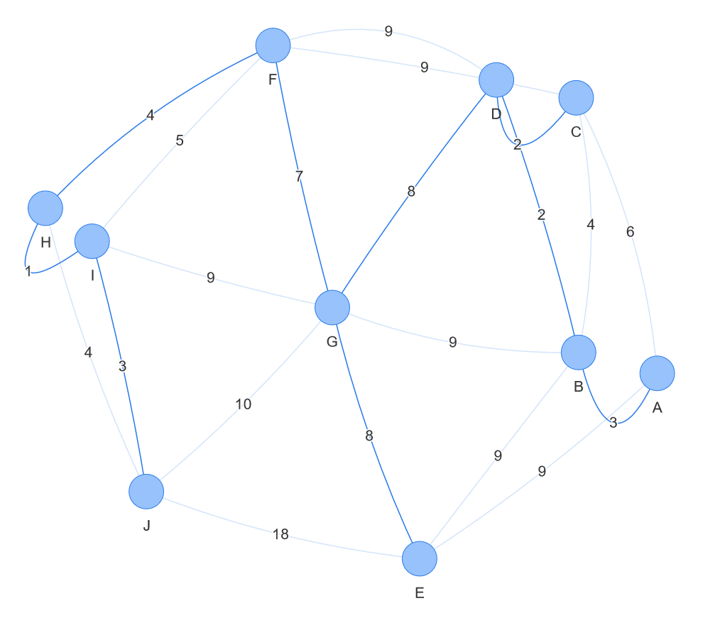

.. _ch-visualisation:

Visualising solutions in the MiniZinc IDE
==============================================

The MiniZinc IDE provides a web-browser based system for visualising solutions generated by MiniZinc.

This feature is currently experimental.

Visualisation library
---------------------

In order to use these features, the library file ``ide/vis.mzn`` must be included:

.. code-block:: minizinc
  
  include "ide/vis.mzn";

Running a model with a visualisation will automatically launch a web browser page containing the visualisation.
If this page is closed, it can be reopened by clicking the hyperlink on the right side of the run's output.

Pre-defined visualisations
--------------------------

There are a number of pre-defined visualisations to suit common use cases, such as line graphs, scatter plots, bar charts, graph visualisation, and 2D packing visualisation.
Multiple visualisations can be shown concurrently.

Documentation for these is available in :ref:`ch-lib-ide-visualisation`.

An example model with a visualisation for a graph along with a time series line graph of the objective value is shown in :numref:`ex-vis-mst`.

.. literalinclude:: examples/visualisation/vis_mst.mzn
  :language: minizinc
  :name: ex-vis-mst
  :caption: Minimum spanning tree data visualisation (:download:`vis_mst.mzn <examples/visualisation/vis_mst.mzn>`).

  
  Minimum spanning tree visualisation result

Custom visualisations
---------------------

A user-defined visualisation can be created by making use of the visualisation JavaScript API from an HTML page.

A MiniZinc model first defines the HTML file to load using the :mzn:`ide_launch_server` predicate.
It can then send solution data to the Visualisation system by outputting JSON data to an output section called ``vis_json``.

This can be done multiple times to start multiple concurrent visualisations.
A exactly one :mzn:`output` statement must be used for each call to :mzn:`ide_launch_server`.

The HTML page is loaded in an embedded web server and has access to the MiniZincIDE JavaScript API, served at ``/minizinc-ide.js``.
The HTML page can use this API to subscribe to events from the IDE and update its visualisation accordingly.

Example visualisation
~~~~~~~~~~~~~~~~~~~~~

In this example, we will create a visualisation for a version of the colouring problem introduced in :ref:`sec-modelling`.

.. figure:: figures/visualisation/aust.*
  
  Australia colouring visualisation result

All files should be placed in the same directory so that they are properly served by the IDE's embedded web server.

.. literalinclude:: examples/visualisation/vis_aust.mzn
  :language: minizinc
  :name: ex-vis-aust-mzn
  :caption: Australia colouring data visualisation model (:download:`vis_aust.mzn <examples/visualisation/vis_aust.mzn>`).

The MiniZinc model contains a call to :ref:`ide_launch_server <mzn_ide.visualisation.ide_launch_server>`.
This initialises the visualisation, telling the IDE what page to load, and the user data to pass to it.
In this case, we are passing string representations of the possible :mzn:`enum` values.
The :mzn:`json_object` function is used to construct a JSON object from a 2D array of keys and strings of valid JSON values.

.. defblock:: Passing JSON data to the visualisation

  It should be noted that :mzn:`showJSON()` allows us to output all MiniZinc values in a JSON representation.
  While this includes sets and enums, the format used may need special handling in the visualisation script.

  In many cases, it may be easier to convert sets into arrays and enums into strings to make them easier to deal with.
  For more information about the JSON format generated, see :ref:`spec-json`.

The :mzn:`output` statement contains an annotation specifying that it should be output to the ``vis_json`` section, which the IDE detects to handle appropriately.
Note that all output here must be valid JSON.
The :mzn:`showJSON` function is used here to ensure this.

.. literalinclude:: examples/visualisation/vis_aust.html
  :language: html
  :name: ex-vis-aust-html
  :caption: Australia colouring data visualisation HTML page (:download:`vis_aust.html <examples/visualisation/vis_aust.html>`).

The visualisation page includes the script ``/minizinc-ide.js``, which is provided by the embedded web server.
This allows access ot the MiniZinc IDE JavaScript API using the ``MiniZincIDE`` object.
The page contains an SVG element containing the basic parts of the visualisation, ready to be coloured when a solution is produced.
Another script, ``vis_aust.js`` is loaded with the visualisation logic.

.. literalinclude:: examples/visualisation/vis_aust.js
  :language: javascript
  :name: ex-vis-aust-js
  :caption: Australia colouring data visualisation script (:download:`vis_aust.js <examples/visualisation/vis_aust.js>`).

The script uses an asynchronous immediately invoked function expression, allowing us to easily use the asynchronous functions in the MiniZincIDE JavaScript API.
``MiniZincIDE.getUserData()`` allows us to retrieve the data we passed to :mzn:`ide_launch_server`.
The function ``setSolution(data)`` is defined to handle the solution data and update the visualisation.
We load the latest solution using ``MiniZincIDE.getSolution(idx)`` if one exists on startup, in case the visualisation page is refreshed or open after solving has begun.
The ``solution`` and ``goToSolution`` events are subscribed to, so we know when to update the visualisation.

MiniZincIDE JavaScript API
~~~~~~~~~~~~~~~~~~~~~~~~~~

The MiniZincIDE JavaScript API provides an asynchronous interface between the IDE and visualisations.

.. code-block:: javascript

    MiniZincIDE.on(event, callback)

Subscribes to the event ``event`` and call ``callback`` whenever it occurs.
The valid events are:

* ``solution``: triggered when a new solution is produced.
  The callback function is passed an object containing the ``time`` of the solution in milliseconds and the ``data`` from the associated ``vis_json`` output statement.

  .. code-block:: javascript

    MiniZincIDE.on('solution', function(solution) {
      console.log(solution.time);
      console.log(solution.data);
    });
* ``goToSolution``: triggered when the user has selected a particular solution to visualise.
  The callback function is passed the solution index to display, or ``-1`` if the user has enabled following the latest solution.
  Visualisations which support showing a particular solution should subscribe to this event.
  
  .. code-block:: javascript

    MiniZincIDE.on('goToSolution', async function(index) {
      const solution = await MiniZincIDE.getSolution(index);
      visualiseSolution(solution);
    });
* ``status``: triggered when a final status line is received (such as ``==========``).
  The callback function is passed an object containing the ``status`` and ``time`` in milliseconds if there is a final status, or otherwise ``null``.
  The ``status`` value can be one of

  * ``ALL_SOLUTIONS``
  * ``OPTIMAL_SOLUTION``
  * ``UNSATISFIABLE``
  * ``UNSAT_OR_UNBOUNDED``
  * ``UNBOUNDED``
  * ``UNKNOWN``
  * ``ERROR``
  
* ``finish``: triggered when solving finishes (or is stopped).
  The callback function is passed the time when solving finished in milliseconds.

.. code-block:: javascript

  MiniZincIDE.off(event, callback)

Unsubscribes from an event given the ``event`` name and ``callback`` function.

.. code-block:: javascript

  MiniZincIDE.getUserData()
  
Returns a ``Promise`` which resolves to the user data passed to ``ide_launch_server()``.

.. code-block:: javascript

  MiniZincIDE.goToSolution(idx)

Requests that the solution with the given index ``idx`` is shown.
This causes the ``goToSolution`` event to be triggered for all visualisations being shown.
Visualisations which allow multiple solutions to displayed simultaneously can call this function when the user interacts on a particular solution.
This allows other visualisations to then also show the solution of interest.

The index ``-1`` is used to request that the latest solution be tracked by the visualisations.

.. code-block:: javascript

  MiniZincIDE.solve(modelFile, dataFiles, options)

Requests that the IDE stop solving the current instance and start solving with the given ``modelFile``, ``dataFiles``, and parameter configuration ``options``
``modelFile`` and ``dataFiles`` may be set to ``null`` to re-solve using the current model and data files.
Otherwise, ``modelFile`` is the path to the ``.mzn`` file to solve and ``dataFiles`` is an array of paths to the ``.dzn`` or ``.json`` files.
These must be in the same directory or a child directory of the current model.
``options`` is an optional object in the parameter configuration file format (see :ref:`ch-param-files`) to be passed to MiniZinc (in addition to the current solver configuration).

.. code-block:: javascript

  MiniZincIDE.getNumSolutions()

Returns a ``Promise`` which resolves to the number of solutions which have been found.

.. code-block:: javascript

  MiniZincIDE.getSolution(index)

Returns a ``Promise`` which resolves to the solution object (containing ``time`` and ``data``) for the given index.
Negative indexes refer to indexes from the end (e.g. ``-1`` refers to the latest solution).

.. code-block:: javascript

  MiniZincIDE.getAllSolutions()

Returns a ``Promise`` which resolves to an array of all solution objects (each containing ``time`` and ``data``).

.. code-block:: javascript

  MiniZincIDE.getStatus()

Returns a ``Promise`` which resolves to an object containing the ``time`` and final ``status``, or ``null`` if there is no final status.

.. code-block:: javascript

  MiniZincIDE.getFinishTime()

Returns a ``Promise`` which resolves to the finishing time, or ``null`` if it has not finished.

