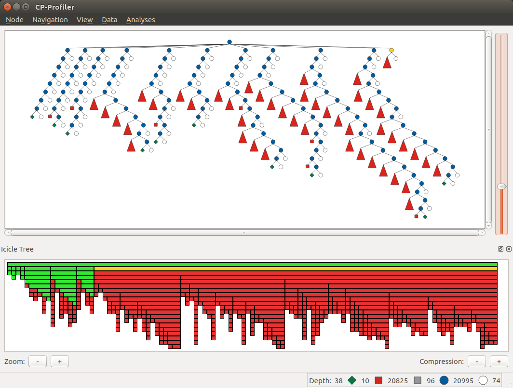
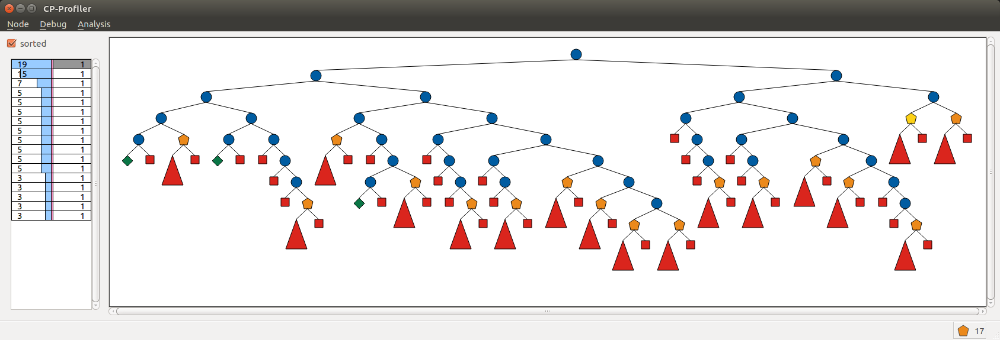

CP-Profiler
================

CP-Profiler provides search tree visualisations for executions of constraint programming solvers.

Connecting a Solver Execution
-----------------------------

1. Starting CP-Profiler

``./cp-profiler``

This starts a local TCP server listening on one of the available ports (6565 by default).

Additionally, a mzn file and a paths file (produced by the MiniZinc compiler) can be specified in order to let the profiler operate on the variable names used in the MiniZinc model:

``./cp-profiler --mzn model.mzn --paths model.paths``

2. Executing a supported solver

The solver must implement the profiling protocol (see below). Integration libraries are available if you wish to extend your solver to work with CP-Profiler.

When a new execution is connected to the profiler it will be added to the list of executions displayed at the top of the main window. For example, in the image below execution *golomb6a.fzn* is shown to be added to the profiler.
To display the execution (traditional visualisation), select its name from the list and click the *Show Tree* button. Note that the solver can still be running the execution, in which case the profiler will draw the search tree in real time.

.. image:: figures/cpprofiler/doc_conductor.png
  :alt: Profiler Conductor

The protocol (high level)
-------------------------

The following describes the protocol that a solver must implement to communicate with the profiler.

The protocol distinguishes between the following types of messages: **Start**, **Restart**, **Done**, and **Node**.

The **Start** message is sent at the beginning of the execution.
The message has two optional parameters:

- ``Name``: execution's descriptor to be presented to the user (e.g. the model's name)
- ``Execution ID``: globally unique identifier used to distinguish between different executions.

The **Restart** message is sent whenever a solver performs a restart in case of a restart-based search.

The **Done** message is sent to the profiler at the end of the execution to indicate that no further nodes should be expected.

The **Node** message is sent whenever a new node is explored by the solver and contains information necessary for reconstructing the search tree. The required parameters are:

- ``Node ID``: unique node identifier in the execution.
- ``Parent ID``: the identifier (``Node ID``) of the parent node. A root node can have an identifier of `-1`.
- ``Alternative``: the node's position relative to its siblings; for the left-most child it is ``0``, for the second left-most it is ``1`` etc.
- ``Number of Children``: the number of children nodes. If not known, can be set to ``0`` and the node will be extended with extra children later on if necessary.It is, however, advisable to specify the number of children the profiler should expect (for example, the yet to arrive nodes can be visualised to give a better idea about the search).
- ``Status``: allows to distinguish between different types of nodes. Supported values are:
     - *BRANCH*: internal node in the tree;
     - *SOLUTION*: leaf node representing a solution;
     - *FAILURE*: leaf node representing a failure;
     - *SKIPPED*: leaf node representing unexplored search space due to backjumping.

**Example**. The following sequence of nodes (excluding the `Start` and `Done` messages) produces the simple tree with three nodes:

========= ===========  =============  ===============  ======================  ==========
``Label`` ``Node ID``  ``Parent ID``  ``Alternative``  ``Number of Children``  ``Status`` 
========= ===========  =============  ===============  ======================  ==========
   Root        0           -1            -1                 2                    BRANCH  
  Failure      1           0             0                  0                    FAILED  
 Solution      2           0             1                  0                    SOLVED  
========= ===========  =============  ===============  ======================  ==========

The protocol (low level)
------------------------

Each message starts with a four-byte integer encoding the size of the remainder of the message in bytes. This is followed by a single byte encoding the type of the message. The corresponding values are: ``Node``: ``0``, ``Done``: ``1``, ``Start``: ``2``, ``Restart``: ``3``.

**Node message**

In case the message is of the type ``Node``, the following fields are added in order: ``id``, ``pid``, ``alt``, ``children`` and ``status``.

Node identifiers ``id`` and ``pid`` are represented using three four-byte integers: first identifies the identifier of the node within a thread, the second — the identifier of the restart (in a restart-based search), and the third — the identifier of the thread.
The ``alt`` and ``children`` fields are represented by a single four byte integer each.
The ``status`` field is represented by a single byte; its possible values are: *SOLVED*: 0, *FAILED*: 1, *BRANCH*: 2, *SKIPPED*: 3.
All multi-byte integer values are encoded using the *two's compliment* notation in the *big-endian order*.

Additionally, each node message can contain the following optional fields:
  - ``label``: branching decision (or any arbitrary string to be drawn together with the node);
  - ``nogood``: string representation of a newly generated nogood in a learning solver;
  - ``info``: arbitrary information about the node.

Field identifiers and their sizes in bytes:

  ============   ========   ============
  field name     field id   size (bytes)
  ============   ========   ============
    ``id``        n/a         12      
    ``pid``       n/a         12      
    ``alt``       n/a          4      
  ``children``     n/a          4      
   ``status``      n/a          1      
    ``label``       0          any     
   ``nogood``       1          any     
    ``info``        2          any     

  ============   ========   ============

**Example**. The following is a possible correspondence between a solver and the profiler that generates a trivial tree. The order in which different fields arrive is shown from top to bottom (rows are numbered for convenience).

*Message 1:*

====== ====================================================================================== =============================
 Row    Bytes                                                                                 Interpretation           
====== ====================================================================================== =============================  
 1      ``00 00 00 21``                                                                       message size (33)             
 2      ``02``                                                                                message type (*START*)        
 3      ``02``                                                                                field (*info*)                
 4      ``00 00 00 1B``                                                                       string size (27)              
 5      ``7b 22 6e 61 6d 65 22 3a 20 22 6d 69 6e 69 6d 61 6c 20 65 78 61 6d 70 6c 65 22 7d``  '{"name": "minimal example"}' 
====== ====================================================================================== =============================

*Message 2:*

===== =============== ========================
 Row  Bytes           Interpretation          
===== =============== ========================
 6    ``00 00 00 2B``  message size (43)       
 7    ``00``           message type (**NODE**) 
 8    ``00 00 00 00``  node id (0)             
 9    ``FF FF FF FF``  node restart id (-1)    
 10   ``FF FF FF FF``  node thread id (-1)     
 11   ``FF FF FF FF``  parent id (-1)          
 12   ``FF FF FF FF``  parent restart id (-1)  
 13   ``FF FF FF FF``  parent thread id (-1)   
 14   ``FF FF FF FF``  alternative (-1)        
 15   ``00 00 00 02``  children (2)            
 16   ``02``           status (*BRANCH*)       
 17   ``00``           field (label)           
 18   ``00 00 00 04``  string size (4)         
 19   ``52 6f 6f 74``  'Root'                  
===== =============== ========================

*Message 3:*

===== =============== ========================
 Row  Bytes           Interpretation          
===== =============== ========================
 20   ``00 00 00 01``  message size (1)        
 21   ``01``           message type (**DONE**) 
===== =============== ========================

Traditional Tree Visualisation
------------------------------

The image below shows an example of a traditional (node-link) visualisation of the search tree. Different types of nodes are shown differently: branch (internal) nodes are shown as blue circles; nodes representing failures are shown as red squares; solution nodes are shown as green diamonds.

Note that the root of the tree is shown in gold colour indicating the currently selected node. Arrow keys on the keyboard allow the user to navigate the tree by changing which node is selected. ``Down`` navigates to the first child of the current node, ``Shift+Down`` -- to its last child, ``Up`` -- to its the parent, ``Left`` -- to its next sibling on the left, ``Right`` -- to its next sibling on the right. 
Additionally, pressing ``R`` will navigate to the root of the tree.
The same actions are available under the **Navigation** menu.

.. image::  figures/cpprofiler/doc_traditional.png
  :alt: Traditional Visualisation Interface

If a subtree contains no solutions, it can be collapsed into a special single node displayed as a large red triangle. By default, the tree will be collapse failed subtrees automatically during its construction as a way to deal with large trees. The image below shows the same search tree as above, but with all failed subtrees collapsed.

.. image::  figures/cpprofiler/doc_collapsed.png
  :alt: Collapsed Failed Subtrees

This view of the tree allows the user to show additional information for every node — its label, which usually represents the branching decision made by the solver to move from the parent node to its child. Pressing ``L`` on the keyboard will display labels for all descendants of the current node. ``Shift+L`` will display labels on the path to the current node.
For example, the visualisation above shows branching decisions on the path from the first solution (shown as the new current node) to the root of the tree.

Status bar at the bottom of the window displays node statistics: the depth of the tree and the counts of different types of nodes.
The scroll bar on the right lets the user to zoom in/out on the visualisation.

**Adding Bookmarks**

The user can *bookmark* any node on the tree associating it with an arbitrary text.
This can be done by selecting the node of interest and clicking on **Add/remove bookmark** from the **Node** menu (shortcut: ``Shift+B``).
This will create a dialog as shown in the image below where the user can enter the bookmark text.

.. image:: figures/cpprofiler/doc_bookmark1.png
  :alt: Adding new bookmark

All bookmarked nodes are marked with a black circle on the traditional visualisation:

.. image:: figures/cpprofiler/doc_bookmark_added.png
  :alt: Added bookmark

This message/node pair is also added to the bookmark list which can be retrieved from the **Data** menu under **Show bookmarks** action as shown below:

.. image:: figures/cpprofiler/doc_bookmark_list.png
  :alt: Bookmark list

Note that each node is represented by a number -- the node's unique identifier in CP-Profiler (it is likely to be different from the identifier sent by the solver).
Clicking on a row will navigate the visualisation to the corresponding bookmarked node.

Alternative Search Tree Visualisations
--------------------------------------

**Lantern Tree**

One disadvantage of the traditional visualisation described above is the fact that when the nodes are collapsed (necessary for large trees) they become indistinguishable from one another.
*Lantern Tree* visualisation addresses this limitation: it draws collapsed nodes in a way that indicate the size of the underlying subtrees.

Consider, for example, the traditional visualisation of a restart-based execution below:

.. image:: figures/cpprofiler/doc_restarts.png
  :alt: Restart execution

Each "restart" is represented by one of the subtrees attached to the "super" root node as a child.
One can quickly determine that all but restarts terminated on finding a solution.
The exception is the last restart in which no solution have been found (it corresponds to the proof of optimality).
However, not much can be concluded about the size of individual restarts, or the amount of search that they represent (at least not at a glance).

The following image shows the same restart tree using this alternative visualisation.
All collapsed subtrees in this case are represented by "lantern" nodes, which cna be seen as a triangle extended with a rectangular section at the bottom.

The lantern tree visualisation is parameterised by *N*, which is the maximum number of nodes a lantern node can represent before splitting into several smaller lanterns.
Note that is rarely possible to collapse subtrees such that each subtree contains exactly *N* nodes.
For this reason, lantern nodes (their rectangular sections) are dynamic in size and grow linearly with the actual number of nodes *n* in the subtree (1 < *n* <= *N*).

.. image:: figures/cpprofiler/doc_restarts_lantern.png
  :alt: Lantern tree visualisation of a restart execution

In this example, the use of the lantern tree reveal additional insight: all but a few last restarts required very little search, and by far the greatest amount of work was done during the "proof of optimality" stage.

The lantern tree visualisation is available by enabling the **Lantern Tree View** option under the **View** menu (shortcut: ``Ctrl+L``).
Clicking on the same option again switches back to the traditional visualisation.

**Pixel Tree**

The pixel tree [1]_ and the icicle tree [2]_ visualisations are a quite different from the traditional visualisation in that they show links between nodes only implicitly, i.e. without drawing edges.

In the pixel tree view nodes are represented by squares (pixels), and edges only implicitly by the indentation between the squares. Parent nodes are placed immediately to the left of their subtree and the leaves of each subtree are grouped to the rightmost position.

The image below shows a correspondence between nodes in a traditional view and those in the pixel tree view. Note that a green vertical line indicates a solution found at the corresponding node.

.. image:: figures/cpprofiler/doc_basic_pt.png
  :alt: Basic pixel tree

One of the main advantages of the pixel tree view is the ability to compress it while preserving large scale patterns and thus providing a good overview of the search. The compression is done by simply allowing multiple nodes on the same horizontal position.

In CP-Profiler the pixel tree can be shown alongside the traditional visualisation by enabling the **Pixel Tree View** option under the **View** menu (shortcut: ``Shift+P``).

The following image shows the pixel tree view for the restart execution discussed earlier.

.. image:: figures/cpprofiler/doc_pt_large2.png
  :alt: Pixel tree with compression

The pixel tree is compressed in this case to fit the entire tree in the window without any need for scrolling.
Vertical green lines indicate that there is a solution node in the corresponding part of the tree.
A vertical slices of the tree can be selected by clicking and dragging with the left mouse key.
Note that in this example a slice just before the final solution is selected (it is shown in red).
Selecting a part of the tree in this way will update the traditional view to reveal the nodes that belong to that part, hiding the rest.

**Icicle Tree**

In the icicle tree parent nodes are positioned strictly above their children, i.e. they span horizontally over the same space as their children nodes. This property allows the user to quickly find a node's ancestry and determine the size of any subtree at a glance.

Icicle trees are compressed by cutting off leaf nodes, so that the corresponding parent nodes become the new leaf nodes.
Doing so in a binary tree, for example, reduces the display area required for the visualisation by a factor of two.
This action is repeated until the visualisation is of the desired size.

In CP-Profiler the icicle tree can be shown alongside the traditional visualisation by enabling the **Icicle Tree View** option under the **View** menu (shortcut: ``Shift+I``).

The following image shows the icicle tree view for the restart execution from before.

Again, the entire tree have been compressed to fit in the window.
The following colour scheme is used: each icicle element that represents a subtree containing a solution is shown in green colour.
All other nodes are shown in red as they represent entirely failed subtrees.
Additionally elements of the icicle tree can be selected (shown in yellow colour) to show the corresponding subtree (node) in the traditional visualisation.
Note that this relationship is two-way bound: selecting a different node in the traditional visualisation will update the icicle tree view correspondingly.

Similar Subtree Analysis
------------------------

This analysis allows users to find similarities within a single search tree.

The analysis can be initiated by selecting **`Similar Subtrees`** from the menu **`Analyses`** (shortcut: ``Shift+S``).
The image below shows the result of running the analysis on the search tree above.
Horizontal bars on the left lists all similarities (patterns) found in the tree.
Here, the lengths of the bars are configured to indicate how many subtrees belong to a particular pattern (*count*).
Additionally the bars are sorted so that the  patterns with subtrees of larger *size* appear at the top.
Another property of a pattern is its *height*, which indicates the height/depth of subtrees that the pattern represent.

Note that in this example the second (from the top) pattern is currently selected (shown with orange outline).
The view on the right shows a "preview" (traditional visualisation) of one of the subtrees representing the selected pattern.
The two rows below the show the result of computing the difference in labels on the path from the root to two of the subtrees representing the pattern (in this case it is the first two subtrees encountered when the tree is traversed in the depth-first-search order).

.. image:: https://bitbucket.org/Msgmaxim/cp-profiler2/raw/dec396e2537294be8cdf18b9594441ac710e937b/docs/images/doc_ss_analysis_hist.png
  :alt: Similar Subtree Analysis Summary

TODO: discuss the two criteria

Changing the configuration menu at the bottom of the window, the user can filter the list of patterns based on their *count* and *height* values.
They way the length of horizontal bars is determined and the sorting criteria can also be specified there.

Whenever a pattern on the left hand side is selected, the corresponding subtrees will be highlighted on the traditional visualisation by drawing their outlines in grey.
Additionally, if the option *Hide not selected* is enabled (top of the window), everything but the subtrees of the current pattern will be collapsed as shown in this example.

.. image:: https://bitbucket.org/Msgmaxim/cp-profiler2/raw/dec396e2537294be8cdf18b9594441ac710e937b/docs/images/doc_ss_analysis.png
  :alt: Similar Subtrees Highlighted

**Elimination of Subsumed Patterns**

A pattern `P` is said to be subsumed by one or more other patterns if subtrees of those patterns
contain all of the subtrees of `P` as descendants.
By default, the analysis is configured to eliminate all subsumed patterns.
Enabling the *Keep subsumed* option (top of the window) will display the subsumed patterns along with non-subsumed patterns.

Execution Comparison by Merging
-------------------------------

CP-Profiler allows users to compare two executions by merging the corresponding search trees.
This is accomplished traversing both trees in lockstep in a depth-first-search manner, starting at the root nodes and comparing corresponding node at each step.
A node is created on the resulting merged tree for every pair of nodes that are deemed identical.
Once a difference is found, a special *pentagon* node is created, whose two children are the roots of the corresponding different subtrees.

This comparison of two execution can be done in CP-Profiler by selecting the two executions of interest from the list of executions and clicking the *Merge Trees* button.

.. image:: figures/cpprofiler/doc_two_execs.png
  :alt: Two executions selected

The image below shows an example of the resulting merged tree.
As indicated in the status bar, this tree contains 17 (orange) pentagons.
The panel on the left lists all pentagons displaying the number of nodes on corresponding left/right subtrees.
By default, the list is sorted by the absolute difference between the number of nodes.
Note that in this case the top pentagon from the list (19 -- 1) is selected, which automatically selects the corresponding node in the visualisation (second last pentagon node, highlighted in yellow).

Replaying Search
----------------

The two main factors that affect a solver execution are propagation and search.
It can be useful to consider propagation and search in isolation (e.g. to aid merging), which can be done using the technique called *search replaying*.
The idea is to force the same search decisions by first performing one execution normally and recording the tree structure and branching decisions (labels) to form a *search log*.
Then the *search log* log is used to drive the search in another execution.

**The protocol for replaying**

The following information (*entry*) is recorded in a *search log* per node: node's unique identifier, the number of children, and the search decisions associated with each child node.
Each entry, in turn, is divided into *tokens* separated by a whitespace character.
The first two tokens are the node's identifier and the number of children (0 for a leaf node).
Entries of branch nodes are extended by a pair of tokens per child, containing the child's identifier and its branching decision.

**Example**

Consider the following basic search tree:

..  image:: figures/cpprofiler/doc_replaying_small_example.png
  :alt: Replaying example: small tree
  :scale: 50%

The corresponding *search log* is as follows:

.. code-block:: text

  0 2 1 X>=0 2 X<0
  1 2 3 Y>=0 4 Y<0
  3 0
  4 0
  2 0

Nogood Analysis
---------------

This analysis is based on the idea of comparing (*merging*) two execution of the same model (instance) using the same search (via *search replaying*), one with nogood learning and the other one -- without (resulting in *learning* and *non-learning* executions).
Since the only difference between the two executions will be in the higher propagation strength in the learning execution due to no-goods, the resulting merged tree will only have pentagons of the form *1/n* (one failure node corresponding to a subtree of *n* nodes in non-learning execution).
*n* in this case is called *search reduction* and it is attributed to all previously generated no-goods that contributed to this early failure.
The analysis aggregates this information throughout the execution, which results in a *nogood ranking* based on how much search reduction each nogood contributed to.

The following steps can be performed to execute the nogood analysis:

1. An instance is executed with a learning solver with profiling on.

For example: ``chuffed pizza.fzn --cpprofiler``.

2. The resulting search is saved to a file using CP-Profiler.

3. The same instance is executed without learning (preferably by the same solver, but a solver with similar propagation will produce similar result).

For example: ``gecode --cpprofiler_replay pizza.search pizza.fzn``

4. The two resulting trees are merged using CP-Profiler.

5. **Nogood analysis** option is selected from the **Analyses** menu in CP-Profiler.

The image below shows a possible result window, in which the ranking is displayed in a tabular form with one row per nogood:

.. image:: figures/cpprofiler/doc_ng_analysis_result.png
  :scale: 80%

The first column identifies the (failed) node at which the nogood has been generated.
The next column shows search reduction (in the number of nodes) attributed to this nogood.
This is followed by the column that shows the number of times the nogood contributed to search reduction, that is, the number of *1/n* pentagons that were partially or solely responsible for the early failure.
Finally, the last column shows the nogood itself in a form of a clause (disjunction of literals) where its literals are separated by a whitespace character.

Note that dy default the entries are sorted based on search reduction.
The sorting criteria can be changed by clicking on corresponding column headers.

This result can be saved to a file (by clicking the **Save Nogoods** button) for further examination.
Each row in the resulting file will correspond to one nogood, and the tab character (``\t``)  will separate different columns.

.. [1] Burch, M. et al., "Indented Pixel Tree Plots", 2010.
.. [2] Kruskal, J. B. et al., "Icicle Plots: Better Displays for Hierarchical Clustering", 1983.