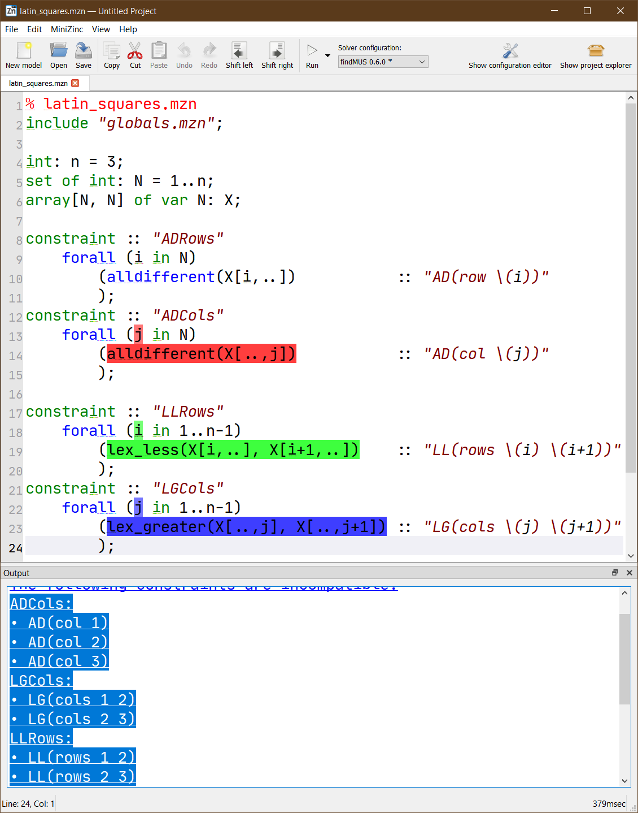
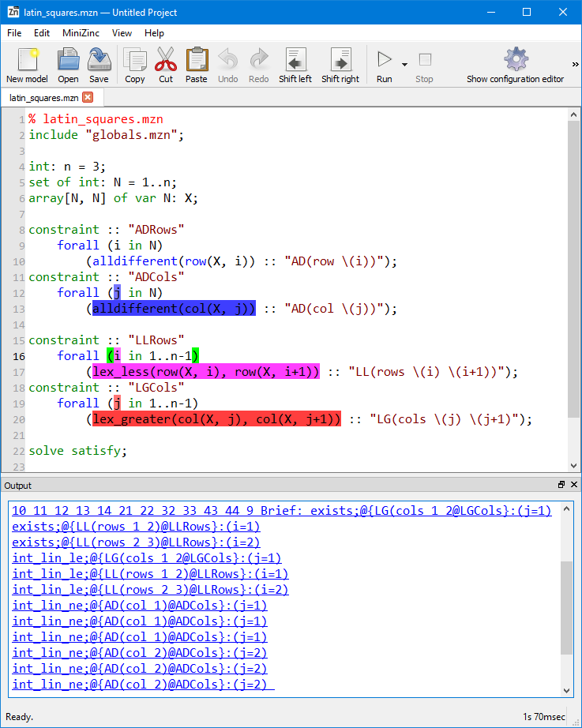

FindMUS 
=======

Version: 0.5.0

FindMUS [1]_ lists unsatisfiable subsets of constraints in your MiniZinc
model.  These subsets, called Minimal Unsatisfiable Subsets can help
you to find faults in your unsatisfiable constraint model.  FindMUS uses
the hierarchical structure provided by the model to guide its search.

Basic Usage
-----------

To use FindMUS on the command line simply execute it on a model and set
of data files by typing:

``findMUS model.mzn data-1.dzn``

This will perform a simple search for a single generalized MUS.
To acquire a more accurate MUS with correct index variable assignments the
``--paramset mzn`` argument should be used. To search for more than one
MUS use the ``-a`` or ``-n <count>`` arguments.  By default FindMUS will
use ``gecode`` for checking the satisfiability of a subset of constraints.
This can be changed using the ``--solver`` argument.  For example, given
a model that is better suited to a Mixed Integer Programming solver,
the argument ``--solver cbc`` could be used to instruct FindMUS to
flatten the model with the linear library and use the CBC solver for
satisfiability checking.

Note: FindMUS requires a fully instantiated constraint model.

Commandline arguments
^^^^^^^^^^^^^^^^^^^^^

The FindMUS tool supports the following arguments:

**Driver options**

The driver creates the map solver and sub-solver and requests MUSes from
FindMUS's enumeration algorithm HierMUS.

``-n &lt;count&gt;``   Stop after the *n* th MUS is found (Default: 1)

``-a``   Find all MUSes

``--timeout &lt;s&gt``   Stop search after *s* seconds (Default: 1800)

``--paramset hint,mzn,fzn``
  Use a preset collection of parameters. The default behaviour of the tool
  is to use the ``hint`` set which should quickly produce an MUS.
  The ``mzn`` and ``fzn`` options can acquire MUSes in more detail.
  
  ``hint`` --structure gen --depth mzn --shrink-alg map_lin

  ``mzn`` --structure normal --depth mzn --shrink-alg map_qx

  ``fzn`` --structure normal --depth fzn --shrink-alg map_qx

**Enumeration options**

The enumeration algorithm (HierMUS) explores the constraint hierarchy
provided in the user's model and proposes potential MUSes to the
sub-solver.  A ``shrink`` algorithm is used to reduce found unsat subsets
to MUSes. There are currently four available shrink algorithms available
with FindMUS.

``--shrink-alg lin,map_lin,qx,map_qx``
  Select shrink algorithm (Default: map_lin)

    ``lin`` simple linear shrink algorithm.

    ``map_lin`` alternative implementation of the linear algorithm that
    updates a global map of explored subsets while shrinking the subset.

    ``qx`` uses the ``QuickXplain`` [4]_ algorithm to shrink the subset
    to a MUS.

    ``map_qx`` is an alternative implementation of ``QuickXplain`` that
    uses the global map to avoid repeating any SAT checks while shrinking.

``--depth mzn,fzn,&lt;n&gt``
  How deep in the tree should search explore. (Default: mzn)

    ``mzn`` expands the search as far as the point when the compiler
    leaves the MiniZinc model.

    ``fzn`` expands search as far as the FlatZinc constraints.

    ``&lt;n&gt`` expand search to the *n* level of the hierarchy.

**Subsolver options**

FindMUS can be used in conjunction with any FlatZinc solver. These
options mimic the ``minizinc`` arguments ``--solver`` and
``--fzn-flags``. The behavior of these arguments is likely to change
in later versions of the tool.

``--solver &lt;s&gt``
  Use solver *s* for SAT checking. (Default: "gecode")

``--solver-flags &lt;f&gt``
  Pass flags *f* to sub-solver. (Default: empty)

``--solver-timelimit &lt;ms&gt``
  Set hard time limit for solver in milliseconds. (Default: 1100)

``--soft-defines``
  Consider functional constraints as part of MUSes

**Filtering options**

FindMUS can include or exclude constraints from its search based on the
expression and constraint name annotations as well as properties of their
paths (for example, line numbers). These filters are currently based on
substrings but in future may support text spans and regular expressions.

``--named-only``
  Only consider constraints annotated with string annotations

``--filter-named &lt;names&gt;`` ``--filter-named-exclude &lt;names&gt;``
Include/exclude constraints with names that match *sep* separated *names*

``--filter-path &lt;paths&gt;`` ``--filter-path-exclude &lt;paths&gt;``
Include/exclude based on *paths*

``--filter-sep &lt;sep&gt;`` Separator used for named and path filters

**Structure options**

The structure coming from a user's model can significantly impact the
performance of a MUS enumeration algorithm. The hierarchy is constructed
in two steps. The first takes the existing model structure and can modify
it in several ways. The second step adds extra binary structure.

``--structure flat,gen,normal,mix``

     Alters initial structure: (Default: ``gen``)

     ``flat``   Remove all structure

     ``gen``    Remove instance specific structure (merges constraints)

     ``normal`` No change

     ``mix``    Apply ``gen`` before ``normal``

     ``idx``    Remove all location information

     ``idxmix`` Apply ``idx`` before ``normal``

``--no-binarize``

     By default will introduce extra binary structure to the
     hierarchy. This option disables this behaviour.

**Verbosity options**

``--verbose-{map,enum,subsolve} &lt;n&gt`` Set verbosity level for
different components

``--verbose`` Set verbosity level of all components to 1

**Misc options**

``--dump-dot &lt;dot&gt`` Write tree in GraphViz format to file <dot>

Example
^^^^^^^

The following demonstrates the basic usage of FindMUS on a simple example.
Below, we see a model for the latin squares puzzle [2]_ with some
incompatible symmetry breaking constraints added.

.. literalinclude:: examples/latin_squares.mzn
  :language: minizinc
  :name: ex-mus-latin
  :caption: Faulty model for Latin Squares (:download:`latin_squares.mzn <examples/latin_squares.mzn>`).

Here we have used the new constraint and expression annotations
added in MiniZinc 2.2.0. Note that these annotations are not
necessary for FindMUS to work but may help with interpreting the
output. The first two constraints: ``ADRows`` and ``ADCols`` define the
``alldifferent`` constraints on the respective rows and columns of the
latin square. The next two constraints ``LLRows`` and ``LGCols`` post
``lex`` constraints that order the rows to be increasing and the columns
to be increasing. Certain combinations of these constraints are going
to be in conflict.

Executing the command ``minizinc --solver -a latin_squares.mzn``
returns the following output. Note that the ``-a`` argument requests
all MUSes that can be found with the default settings (more detail below).

.. code-block:: minizincdef

    FznSubProblem:  hard cons: 36   soft cons: 26   leaves: 26      branches: 21    Built tree in 0.03100 seconds.
    SubsetMap:      nleaves:        4       nbranches:      1
    MUS: 0 1 2 21 22 3 32 33 4 43 44 5 54 55 6 7 8
    Brief: exists;@{LG(cols 1 2@LGCols}:() exists;@{LG(cols 2 3@LGCols}:() exists;@{LL(rows 1 2)@LLRows}:() exists;@{LL(rows 2 3)@LLRows}:() int_lin_le;@{LG(cols 1 2@LGCols}:() int_lin_le;@{LG(cols 2 3@LGCols}:() int_lin_le;@{LL(rows 1 2)@LLRows}:() int_lin_le;@{LL(rows 2 3)@LLRows}:() int_lin_ne;@{AD(row 1)@ADRows}:() int_lin_ne;@{AD(row 1)@ADRows}:() int_lin_ne;@{AD(row 1)@ADRows}:() int_lin_ne;@{AD(row 2)@ADRows}:() int_lin_ne;@{AD(row 2)@ADRows}:() int_lin_ne;@{AD(row 2)@ADRows}:() int_lin_ne;@{AD(row 3)@ADRows}:() int_lin_ne;@{AD(row 3)@ADRows}:() int_lin_ne;@{AD(row 3)@ADRows}:()

    Traces:
    latin_squares.mzn|9|5|10|51|ca|forall
    latin_squares.mzn|16|5|17|68|ca|forall
    latin_squares.mzn|19|5|20|70|ca|forall
    ====================

    MUS: 10 11 12 13 14 15 16 17 21 22 32 33 43 44 54 55 9
    Brief: exists;@{LG(cols 1 2@LGCols}:() exists;@{LG(cols 2 3@LGCols}:() exists;@{LL(rows 1 2)@LLRows}:() exists;@{LL(rows 2 3)@LLRows}:() int_lin_le;@{LG(cols 1 2@LGCols}:() int_lin_le;@{LG(cols 2 3@LGCols}:() int_lin_le;@{LL(rows 1 2)@LLRows}:() int_lin_le;@{LL(rows 2 3)@LLRows}:() int_lin_ne;@{AD(col 1)@ADCols}:() int_lin_ne;@{AD(col 1)@ADCols}:() int_lin_ne;@{AD(col 1)@ADCols}:() int_lin_ne;@{AD(col 2)@ADCols}:() int_lin_ne;@{AD(col 2)@ADCols}:() int_lin_ne;@{AD(col 2)@ADCols}:() int_lin_ne;@{AD(col 3)@ADCols}:() int_lin_ne;@{AD(col 3)@ADCols}:() int_lin_ne;@{AD(col 3)@ADCols}:()

    Traces:
    latin_squares.mzn|16|5|17|68|ca|forall
    latin_squares.mzn|12|5|13|51|ca|forall
    latin_squares.mzn|19|5|20|70|ca|forall
    ====================

    Total Time: 0.24700     nmuses: 2       map: 10 sat: 6  total: 16

    =====UNKNOWN=====

The first two lines, starting with ``FznSubProblem:`` and ``SubsetMap``
provide some useful information for debugging the ``findMUS`` tool.
Next we have the list of MUSes separated by a series of equals ``=``
signs.  Each MUS is described with three sections:

 #. ``MUS:`` lists the indicies of FlatZinc constraints involved in
    this MUS.
 #. ``Brief:`` lists the FlatZinc constraint name, the
    expression name, and the constraint name for each involved FlatZinc
    constraint.
 #. ``Traces:`` lists the MiniZinc paths corresponding to the constraints
    of the MUS.
    Each path typically contains a list of path elements separated by
    semi-colons ``;``. Each element includes a file path, a start line,
    start column, end line and end column denoting a span of text from
    the listed file. And finally, a description of the element.
    In the examples above all paths point to calls to a forall on
    different lines of the model. (``ca|forall``)

The final line of output lists the ``Total Time``, the number of MUSes
found, and some statistics about the number of times the internal map
solver ``map`` was called, and the number of times the subproblem solver
was called ``sat``.

Interpreting the two MUSes listed here we see that the ``lex``
constraints from lines 16 and 19 were included in both and only one of
the ``alldifferent`` constraints from line 9 and 12 are required for
the model to be unsatisfiable.  The ``lex`` constraints being involved
in every MUS make them a strong candidate for being the source of
unsatisfiability in the user's model.

Using FindMUS in the MiniZinc IDE
---------------------------------

To use FindMUS in the MiniZinc IDE, upon discovering that a model is
unsatisfiable. Select ``FindMUS`` from the solver configuration dropdown
menu and click the solve button (play symbol).  By default FindMUS is
configured to return a single MUS using the ``hint`` parameter set.
This should be relatively fast and help locate the relevant constraint
items.  The following shows the result of running FindMUS with the
default options.

Selecting the returned MUS highlights three top level constraints as
shown: ``ADRows``, ``LLRows`` and ``LGCols``.  To get a more specific
MUS we can instruct FindMUS to go deeper than the top level constraints
by clicking the "Show configuration editor" button in the top right
hand corner of the MiniZinc IDE window, and selecting the "Extra solver
options" and selecting the ``mzn`` option under "Preset parameters".
The following shows a more specific MUS in this model.

In this case we can see that the output pane lists more specific
information about the constraints involved in the MUS. After each
listed constraint name we see what any loop variables were
assigned to when the constraint was added to the FlatZinc. For
example ``(j=2)``.

How it works
------------
A simple explanation of the algorithm is presented here. For a more
detailed exploration of an earlier version of the approach see the
Debugging Unsatisfiable Constraint Models paper [1]_.

The approach takes the full FlatZinc program and paritions the constraints
into groups based on the hierarchy provided in the user's model. To
begin with (at depth '1') we search for MUSes in the set of top level
constraint items using the MARCO [3]_ MUS enumeration algorithm. If we
are not at the target depth we recursively select a found MUS, split
its constituent constraints into lower level constraints based on the
hierarchy and begin another search for MUSes underneath this high-level
MUS. If any MUSes are found we know that the high-level MUS is not minimal
and so it should not be reported.  This process is repeated on any found
unsatisfiable subsets until we reach the required depth at which point
we will start to repot MUSes. If in the recursive search we return to a
high-level MUS without finding any sub-MUSes we can report this MUS as
a real MUS. This recursive process is referred to as HierMUS. At each
stage when we request the enumeration of a set of MUSes underneath a
high-level MUS we can use one of several MUS enumeration algorithms.

Performance tips
----------------

If you are trying to find MUSes in a very large instance it is advised to
make use of the filtering tools available. Use the default settings to
find a very high-level MUS and then use the ``--depth`` option to find
lower-level, more specific MUSes in conjunction with the ``--filter-name``
and ``--filter-path`` options to focus on finding specific sub-MUSes of a
found high-level MUS.

Limitations / Future work
-------------------------

There are several features that we aim to include quite soon:

  Regular expression based filtering
    This will allow more complex filtering to be used.

  Text span based filtering
    This will allow a user to simply click-and-drag a selection around the
    parts of a constraint model they wish to analyse.

.. [1] Leo, K. et al., "Debugging Unsatisiable Constraint Models", 2017.
.. [2] https://en.wikipedia.org/wiki/Latin_square
.. [3] Liffiton, M. H. et al., "Fast, Flexible MUS Enumeration", 2016.
.. [4] Junker, U. et al., "QUICKXPLAIN: preferred explanations and relaxations for over-constrained problems", 2004.
