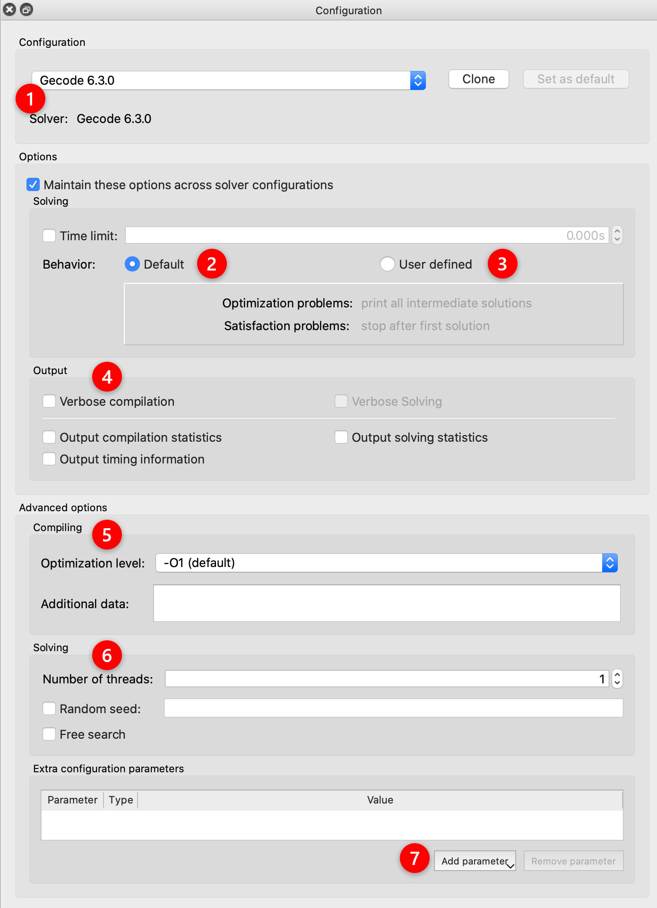
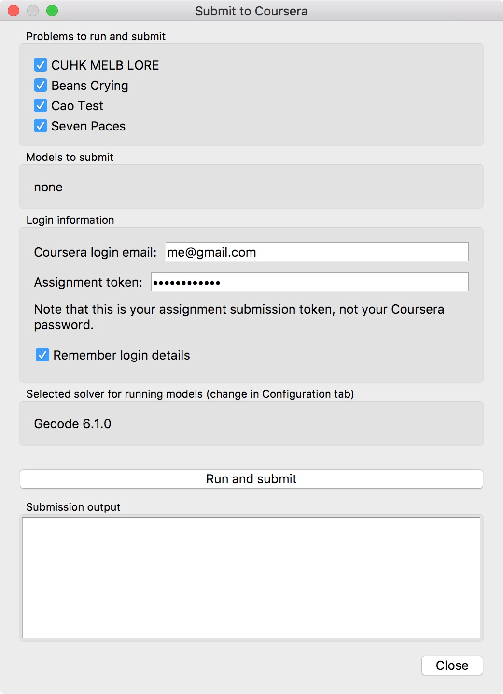
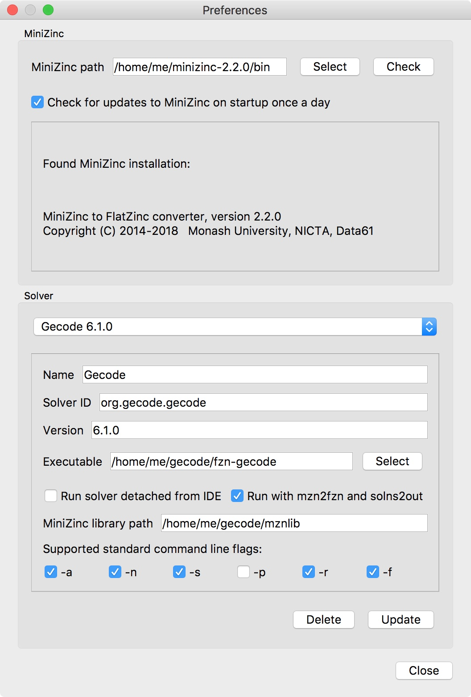

.. _ch-ide:

The MiniZinc IDE
================

The MiniZinc IDE lets you edit and run MiniZinc models. It requires a working installation of the MiniZinc tool chain (which is included when you download the *bundled version* of the IDE). For installation instructions, see :numref:`ch-installation`. This document assumes that you have installed the IDE from the bundled binary distribution, which means that it will already be configured correctly when you start it for the first time. The configuration options are described in :numref:`sec-ide-config`.

:numref:`ch-first-steps` contains an introduction to the absolute basics of working with the IDE. This document goes into a bit more detail.

Editing files
-------------

The basic editor provides the usual functionality of a simple text editor. You can edit MiniZinc models (file extension ``.mzn``) and data files (``.dzn``). When you first open the MiniZinc IDE, you are presented with an empty *Playground* editor, which lets you quickly try out simple MiniZinc models (it does not have to be saved to a file before running a solver on it).

Each file will be opened in a separate tab. To switch between files, click on the tab, select the file from the *Window* menu, or use the *Previous tab*/*Next tab* options from the *View* menu.

When saving a file, make sure that you select the correct file type (represented by the file extension). Models should be saved as ``.mzn`` files, while data files should have a ``.dzn`` extension. This is important because the IDE will only let you invoke the solver on model files.

Editing functions
~~~~~~~~~~~~~~~~~

The *Edit* menu contains the usual functions for editing text files, such as undo/redo, copy/cut/paste, and find/replace. It also allows you to jump to a particular line number (*Go to line*), and to shift the currently selected text (or the current line if nothing is selected) right or left by two spaces. The *(Un)comment* option will turn the current selection (or current line) into comments, or remove the comment symbols if it is already commented.

Fonts and dark mode
~~~~~~~~~~~~~~~~~~~

You can select the font and font size in the *View* menu. We recommend to use a fixed-width font (the IDE should pick such a font by default).

The *View* menu also lets you activate "dark mode", which switches the colour scheme to a dark background.

Configuring and Running a Solver
--------------------------------

The MiniZinc IDE automatically detects which solvers are available to MiniZinc. You can select the solver to use from the solver selection drop-down menu next to the *Run* icon in the tool bar:

.. image:: figures/ide-run.jpg
    :width: 500px

Running a model
~~~~~~~~~~~~~~~

MiniZinc models can be compiled and run by clicking the *Run* icon, selecting *Run* from the *MiniZinc* menu, or using the keyboard shortcut :kbd:`Ctrl+R` (:kbd:`Cmd+R` on macOS). The IDE will use the currently selected solver for compiling and running the model.

Running a model will open the *Output* window, usually located at the bottom of the IDE's main window. MiniZinc displays progress messages as well as any output received from the solver there. If compilation resulted in an error message, clicking on the error will jump to the corresponding location in the model or data file.

The current run can be aborted by clicking the *Stop* icon, selecting *Stop* from the *MiniZinc* menu, or using the keyboard shortcut :kbd:`Ctrl+E` (:kbd:`Cmd+E` on macOS).

If the selected model requires some parameters to be set before it can be run, the MiniZinc IDE will open a parameter dialog. It has two tabs. The left tab lets you enter the parameters manually:

.. image:: figures/ide-data-enter.jpg
    :width: 300px

The second tab lets you select one or several of the data files that are currently open:

.. image:: figures/ide-data-file.jpg
    :width: 300px

Solver configurations
~~~~~~~~~~~~~~~~~~~~~

Selecting one of the built-in solvers from the drop-down menu activates its default configuration. In order to change the solver's behaviour, open the solver configuration editor by clicking on the icon in the tool bar, selecting *Show configuration editor* from the *MiniZinc*/*Solver configurations* menu, or using the keyboard shortcut :kbd:`Ctrl+Shift+C` (:kbd:`Cmd+Shift+C` on macOS).

.. _fig-solver-conf:

  
    The solver configuration window

:numref:`fig-solver-conf` shows the configuration window. The first section (marked with a ``1`` in a red circle) contains a drop-down menu to select the *solver configuration*. In this case, a built-in configuration for the COIN-BC solver was selected. You can make this configuration the default (the MiniZinc IDE will remember this setting), you can reset all values to the defaults, and you can make a clone of the configuration. Cloning a configuration is useful if you want to be able to quickly switch between different sets of options.

Note that any changes to the built-in configurations will be lost when you close the IDE. Any changes to a cloned configuration are saved as part of the *project* (see :numref:`ch-ide-projects`).

The *Solving* section below contains a number of general options. First of all, it shows the concrete solver used in this configuration. Below that, you can set a time limit, after which the execution will be stopped. The built-in configurations all use the "default behaviour" (marked with a ``2``), which is to print all intermediate solutions for optimisation problems, and stop after the first found solution for satisfaction problems. To change this, you can select *User-defined behavior* instead (marked with a ``3``).

The next section, *Compiler options* (marked with a ``4``), controls different aspects of the compilation from MiniZinc to FlatZinc for the selected solver. The first two checkboxes control verbosity and statistics output of the compiler. The drop-down below controls the optimisation level of the compiler, i.e., how much effort it should spend on creating the best possible FlatZinc representation for the given model. The two input fields below allow you to specify additional data (passed into the compilation as if it was part of a ``.dzn`` file) and additional command line options for the compiler.

The *Solver options* section (marked with a ``5``) contains configuration options for the selected solver. Only options that are supported by the solver will be available, others will be grayed out (e.g., the selected solver in :numref:`fig-solver-conf` does not support setting a random seed, or free search).

Finally, the *Output options* section gives you control over the output behaviour. The first tick box enables you to clear the *Output* window automatically every time you run a model. The second option inserts timing information into the stream of solutions. The third check box (*Check solutions*) is described in :numref:`ch-ide-solution-checking` below. The *Compress solution output* option is useful for problems that produce a lot (read: thousands) of solutions, which can slow down and clutter the output window. The compression works by printing just the number of solutions rather than the solutions themselves. For example, the following model would produce 1000 solutions when run with *User-defined behavior* and solution limit set to 0:

.. code-block:: minizinc

  var 1..1000: x;
  solve satisfy;

When runnning with compression set to 100, MiniZinc will output the first 100 solutions, and then a sequence of output like this:

.. code-block:: none

  [ 100 more solutions ]
  [ 200 more solutions ]
  [ 400 more solutions ]
  [ 199 more solutions ]
  x = 1000;
  ----------
  ==========
  
The number of solutions captured by one of the ``... more solutions`` lines is doubled each time, in order to keep the overall output low. The last solution produced by the solver will always be printed (since, in the case of optimisation problems, the last solution is the best one found).

.. _ch-ide-solution-checking:

Automatic Solution Checking
~~~~~~~~~~~~~~~~~~~~~~~~~~~

MiniZinc can automatically run the output of a model through a *solution checker*, another MiniZinc model that verifies that the solution satisfies a given set of rules. This can be useful for teaching constraint modelling, if the solution checker is given to students. Another use case is to use a simple checker while working on a more complex model, to ensure that the complex model still meets the specification.

The default behaviour of the MiniZinc IDE is to run a solution checker if one is present. For a model ``abc.mzn``, a solution checker must be called ``abc.mzc`` or ``abc.mzc.mzn``. If a checker is present, the *Run* icon will turn into a *Run + check* icon instead. The output of the solution checker is displayed together with the normal solution output in the *Output* window.

You can disable solution checkers by deselecting the *Check solutions* option in the solver configuration window.

Compiling a model
~~~~~~~~~~~~~~~~~

It can sometimes be useful to look at the FlatZinc code generated by the MiniZinc compiler for a particular model. You can use the *Compile* option from the *MiniZinc* menu to compile the model without solving. The generated FlatZinc will be opened in a new tab. You can edit and save the FlatZinc to a file, and run it directly (without recompiling).

.. _ch-ide-projects:

Working With Projects
---------------------

Each main window of the MiniZinc IDE corresponds to a *project*, a collection of files and settings that belong together. A project can be saved to and loaded from a file.

You can open a new project by selecting the *New project* option from the *File* menu, or using the :kbd:`Ctrl+Shift+N` keyboard shortcut (:kbd:`Cmd+Shift+N` on macOS).

.. _fig-project-explorer:

.. figure:: figures/ide-project-explorer.jpg
    :figwidth: 200px

    Project explorer

All the files that belong to the current project are shown in the *Project explorer* (see :numref:`fig-project-explorer`), which can be opened using the tool bar icon, or using the *Show project explorer* option in the *View* menu. The project explorer lets you run the model in the currently active tab with any of the data files by right-clicking on a ``.dzn`` file and selecting *Run model with this data*. Right-clicking any file presents a number of options: opening it, removing it from the project, renaming it, running it, and adding new files to the project.

A saved project contains the following pieces of information:

- The names of all files in the project. These are stored as relative paths (relative to the project file).
- Which files were open in tabs (and in which order) at the time the project was saved.
- The active solver configuration.
- The state of any cloned solver configuration.

The following will *not* be saved as part of the project:

- The contents of the *Output* window.
- The state of the built-in solver configurations.

Submitting Solutions to Online Courses
--------------------------------------

The MiniZinc IDE has built-in support for submitting solutions and models to online courses, including the Coursera courses that introduce modelling in MiniZinc:

- `Basic Modeling for Discrete Optimization <https://www.coursera.org/learn/basic-modeling>`__
- `Advanced Modeling for Discrete Optimization <https://www.coursera.org/learn/advanced-modeling>`__

The submission system is controlled by a file called ``_mooc``, which is typically part of the projects that you can download for workshops and assignments. When a project contains this file, a new submission icon will appear in the tool bar, together with an option in the *MiniZinc* menu.

Clicking the icon (or selecting the menu option) opens the submission dialog (see :numref:`fig-ide-submit`). It lets you select the problems that you would like to run on your machine, after which the solutions will be sent to the online course auto-grading system. Some projects may also contain model submissions, which are not run on your machine, but are evaluated by the online auto-grader on new data that was not available to you for testing.

You will have to enter the assignment-specific login details. By clicking the *Run and submit* button, you start the solving process. When it finishes, the MiniZinc IDE will upload the solutions to the auto-grading platform.

.. _fig-ide-submit:

    
    Submitting to Coursera

.. _sec-ide-config:

Configuration Options
---------------------

The MiniZinc IDE can be configured through the *Preferences* dialog in the *MiniZinc* menu (on Windows and Linux) or the *MiniZincIDE* menu (on macOS), as shown in :numref:`fig-ide-gurobi`.

.. _fig-ide-gurobi:

.. figure:: figures/ide-gurobi.jpg
    :figwidth: 500px

Locating the MiniZinc installation
~~~~~~~~~~~~~~~~~~~~~~~~~~~~~~~~~~

The most important configuration option is the path to the ``minizinc`` executable. In the example in :numref:`fig-ide-gurobi`, this field has been left empty, in which case ``minizinc`` is assumed to be on the standard search path (usually the ``PATH`` environment variable). Typically, in a bundled binary installation of MiniZinc, this field can therefore be left empty.

If you installed MiniZinc from sources, or want to switch between different versions of the compiler, you can add the path to the directory that contains the ``minizinc`` executable here. You can select a directory from a file dialog using the *Select* button, or enter it manually. Clicking the *Check* button will check that ``minizinc`` can in fact be run, and has the right version. The version of ``minizinc`` that was found is displayed below the path input field. :numref:`fig-ide-preferences` below shows an example where MiniZinc is located at ``/home/me/minizinc-2.2.0/bin``.

You can have the MiniZinc IDE check once a day whether a new version of MiniZinc is available.

.. _sec-ide-add-solvers:

Adding Third-Party Solvers
~~~~~~~~~~~~~~~~~~~~~~~~~~

The *Solver* section of the configuration dialog can be used to inspect the solvers that are currently available to MiniZinc, and to add new solvers to the system.

Configuring existing solvers
++++++++++++++++++++++++++++

You can use the configuration dialog to set up defaults for the installed solvers. In the current version of the MiniZinc IDE, this is limited to configuring the CPLEX and Gurobi backends. The bundled binary version of MiniZinc comes with support for loading CPLEX and Gurobi as *plugins*, i.e., MiniZinc does not ship with the code for these solvers but can load them dynamically if they are installed.

For example, :numref:`fig-ide-gurobi` shows a potential configuration for Gurobi. On Windows, the library is called ``gurobiXX.dll`` (in the same directory as the ``gurobi`` executable), and on Linux and macOS is it ``libgurobiXX.so`` (in the ``lib`` directory of your Gurobi installation), where ``XX`` stands for the version number of Gurobi.

If you select the CPLEX solver, a similar option appears (``--cplex-dll``).
On Windows, the CPLEX library is called ``cplexXXXX.dll`` and typically found in same directory as the ``cplex`` executable. On Linux it is ``libcplexXXX.so``, and on macOS ``libcplexXXXX.jnilib``, where ``XXX`` and ``XXXX`` stand for the version number of CPLEX.

Adding new solvers
++++++++++++++++++

The example in :numref:`fig-ide-preferences` shows a potential configuration for Gecode, which was installed in ``/home/me/gecode``.

.. _fig-ide-preferences:

Each solver needs to be given 

- a name;
- a unique identifier (usually in reverse domain name notation);
- a version string; and
- the executable that can run FlatZinc.

In addition, you can specify the location of a solver-specific MiniZinc library (see :numref:`ch-solver-specific-libraries` for details). If you leave this field empty, the MiniZinc standard library will be used. The path entered into this field should be an absolute path in the file system, without extra quoting, and without any command line arguments (such as ``-I``).

Most solvers will require compilation and output processing, since they only deal with FlatZinc files. For these solvers, the *Run with mzn2fzn and solns2out* option must be selected. For solvers that can deal with MiniZinc models natively, this option can be deselected.

Some solvers open an independent application with its own graphical user interface. One such example is the *Gecode (Gist)* solver that comes with the bundled version of the IDE. For these solvers, select the *Run solver detached from IDE* option, so that the IDE does not wait for solver output.

Finally, you can select which command line flags are supported by the solver. This controls which options will be available in the solver configuration window.

Solver configurations that are edited or created through the IDE are saved in a configuration file in a standard location. These solvers are therefore available the next time the IDE is started, as well as through the ``minizinc`` command line tool.

.. .. _sec-ide-vis:
..
.. Solution Visualisations
.. -----------------------
..
..
